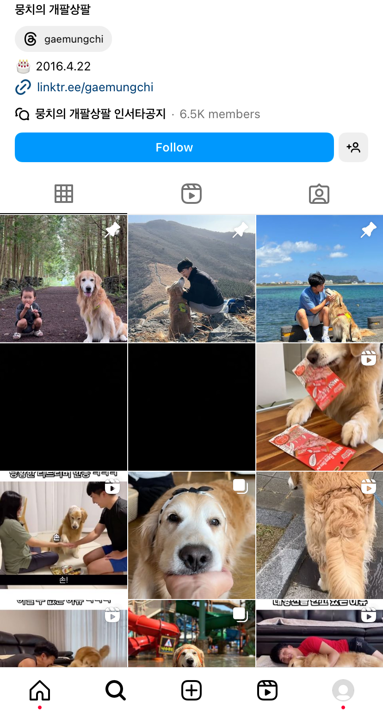

# data

## 레포지토리 설명
이미지 키워드 추출 모델 탐색 레포지토리입니다.

 

## 모델 테스트 결과
### CLIP
단일 이미지에 대해 평균 3초 내외의 시간이 소요됩니다. \
동떨어진 키워드를 추출하진 않는데, OpenAI보단 정확도가 낮은 편입니다.

 

### USE-EfficientNet
단일 이미지 기준 평균 0.1초 미만으로 속도는 빠릅니다. \
정확도가 CLIP과 비슷하거나 낮은 편이고, 결과가 불안정한 것 같습니다.

(주기적으로 모델 캐시 제거 후 테스트 진행해야 하는 것 같습니다..)

 

### OpenAI (gpt-4-turbo)
정확도는 매우 높은데, 상대적으로 속도가 느린 편입니다. \
그리고 API 사용 비용이 듭니다.

여러 이미지를 한 번에 요청하고, 병렬 처리 등을 고려하면 속도랑 비용은 어느 정도 개선 가능할 것 같습니다. \
(현재 이미지 10개까지 한 번에 요청해봤고, 약 27초 걸렸습니다.)

 

*여러 케이스를 테스트해본 것은 아니라, 모델 추가 검증 및 테스트가 필요합니다.

 

## 모델 테스트 결과 분석
*가장 최근 테스트 결과를 기준으로 작성했습니다.

### 프로필 일부 및 최근 게시글 9개
|                                   | CLIP                                         | OpenAI                             | 
|-----------------------------------|----------------------------------------------|------------------------------------|
|    | ['스포츠/운동', '미디어/엔터테인먼트', '일상']        | ['스포츠/운동', '일상', '여행']         |
|    | ['스포츠/운동', '기타', '일상']                   | ['스포츠/운동', 'F&B', '일상']         |
|    | ['F&B', '미디어/엔터테인먼트', '만화/애니/툰']       | ['홈/리빙', '일상', '육아/키즈']        |
|    | ['만화/애니/툰', '일상', '결혼/연애']              | ['만화/애니/툰', '일상', '취미/문화']    |
|    | ['일상', '반려동물', '만화/애니/툰']               | ['반려동물', '일상', '여행']           |
|    | ['일상', '스타/연예인', '기타']                   | ['뷰티', '일상', '육아/키즈']          |
|    | ['F&B', '일상', '기타']                        | ['F&B', '일상', '여행']              |
|    | ['여행', '일상', '기타']                        | ['여행', '일상', '스타/연예인']         |
|    | ['스타/연예인', '패션', '일상']                   | ['패션', '뷰티', '일상']              |
|  | ['미디어/엔터테인먼트', '스타/연예인', '스포츠/운동']  | ['뷰티', '패션', '일상']               |
| 이미지당 평균 소요 시간(초)             | 3.439                                        | 2.910                              |

 

### 최근 게시글 12개
|                              | CLIP                                         | OpenAI                             | 
|------------------------------|----------------------------------------------|------------------------------------|
|    | ['스포츠/운동', '일상', '취미/문화']               | ['스포츠/운동', '일상', '스타/연예인']    |
|    | ['스포츠/운동', '스타/연예인', '미디어/엔터테인먼트']   | ['스포츠/운동', '일상', '여행']         |
|    | ['홈/리빙', '일상', '취미/문화']                  | ['홈/리빙', '일상', '기타']            |
|    | ['만화/애니/툰', '일상', '결혼/연애']              | ['만화/애니/툰', '취미/문화', '일상']    |
|    | ['일상', '반려동물', '취미/문화']                 | ['반려동물', '일상', '여행']            |
|    | ['육아/키즈', '일상', '결혼/연애']                | ['육아/키즈', '일상', '기타']           |
|    | ['F&B', '일상', '취미/문화']                    | ['F&B', '일상', '기타']               |
|    | ['여행', '일상', '기타']                        | ['여행', '일상', '스타/연예인']          |
|    | ['패션', '스타/연예인', '기타']                   | ['패션', '스타/연예인', '일상']         |
|  | ['패션', '뷰티', '일상']                        | ['뷰티', '스타/연예인', '일상']          |
| 이미지당 평균 소요 시간(초)        | 3.401                                        | 2.926                              |