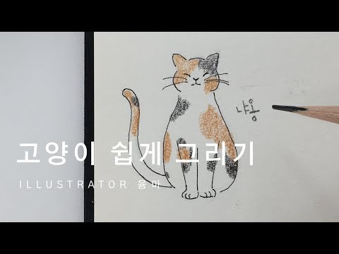
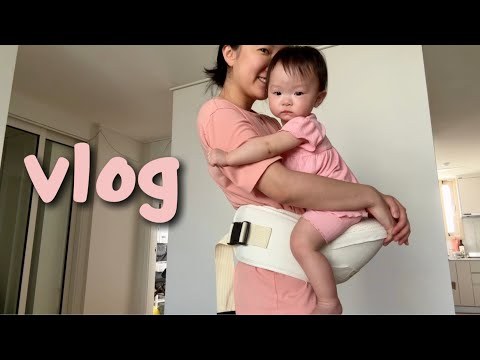
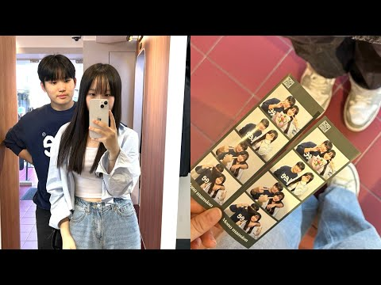
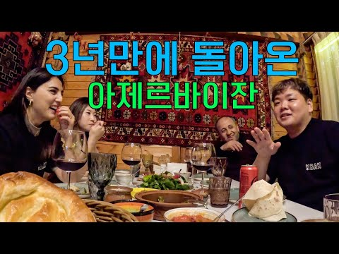
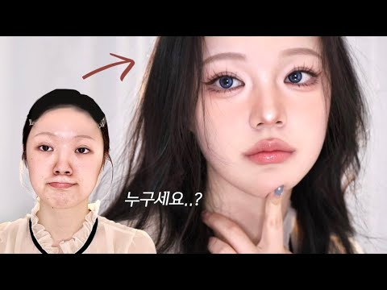
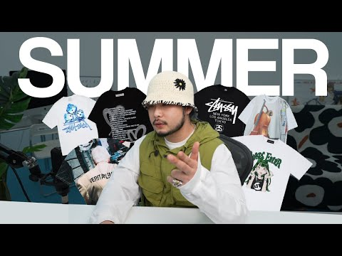
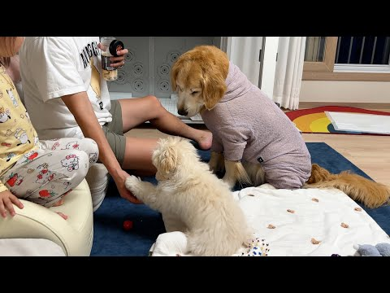
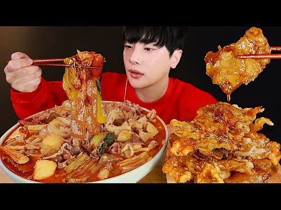
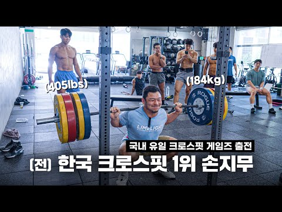

## 모델 테스트 결과 분석
### 목적
사용한 모델은 CLIP ViT-B/32이며,
진행한 테스트는 아래와 같습니다.
(동영상 분석이 아닌 이미지로 정확한 키워드 추출이 가능한지 확인하기 위함.)

 

**유튜브 섬네일 > 키워드 추출 **
- Input: 유튜브 섬네일 이미지 1개 
- Output: 피처링 정의 카테고리 3개

 

### 결과
**특정 영상**
|                              | CLIP: 유튜브 섬네일 > 키워드                                         |
|------------------------------|----------------------------------------------|
| **이미지당 평균 소요 시간(초)**             | 0.572                                        |
|                         | ['기타', '패션', '일상']                         |
|                         | ['만화/애니/툰', '일상', '취미/문화']                         |
|  | ['육아/키즈', '일상', '패션']   |
|    | ['일상', '결혼/연애', '패션']                  |
|   | ['결혼/연애', 'F&B', '일상']              |
|    | ['일상', '취미/문화', '뷰티']                 |
|    | ['패션', '일상', '취미/문화']                |
|    | ['반려동물', '육아/키즈', '일상']                   |
|    | ['일상', 'F&B', '결혼/연애']                   |
|    | ['스포츠/운동', '일상', '자동차/모빌리티']                   |
|    | ['홈/리빙', '취미/문화', '미디어/엔터테인먼트']                   |
